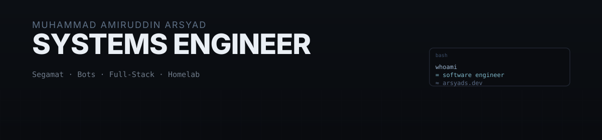

  

Self-taught **Software & Systems Engineer** from Segamat, Johor — coding since Darjah 4 (2021). I build Telegram/WhatsApp bots, full-stack web apps, homelab infrastructure, and network security tooling.

Portfolio: **[arsyads.dev](https://arsyads.dev)** · Known online as **Mr. Arsyad**

---

#### What I'm doing

- Working on personal projects (web apps + Discord bots)
- Tinkering with VPS/cPanel automation
- Exploring web security and Next.js

#### Stack

`Telegram Bot` · `WhatsApp Bot` · `Node.js` · `React / Next.js` · `WireGuard` · `Pterodactyl` · `cPanel/VPS` · `Network Security` · `TypeScript`

#### Projects

- [**Web-Security-Toolkit**](https://github.com/AmirSys-dev/Web-Security-Toolkit) — toolkit for basic web app auditing.
- [**Cexi-Drive**](https://github.com/AmirSys-dev/Cexi-Drive) — cloud storage built with Next.js.
- [**CPanel-Management-Engine**](https://github.com/AmirSys-dev/CPanel-Management-Engine) — automation for cPanel/VPS workflows.
- [**BotProtect-Discord-Bot**](https://github.com/AmirSys-dev/BotProtect-Discord-Bot) — Discord bot for file monitoring and server protection.

---

#### Activity

<picture>
  <source media="(prefers-color-scheme: dark)" srcset="https://raw.githubusercontent.com/AmirSys-dev/AmirSys-dev/output/github-contribution-grid-snake-dark.svg">
  <source media="(prefers-color-scheme: light)" srcset="https://raw.githubusercontent.com/AmirSys-dev/AmirSys-dev/output/github-contribution-grid-snake.svg">
  
</picture>

---

#### Contact

[amirsyse@gmail.com](mailto:amirsyse@gmail.com) · [Telegram](https://t.me/colebrs) · [WhatsApp](https://wa.me/601171341399)

Off keyboard, play badminton.
